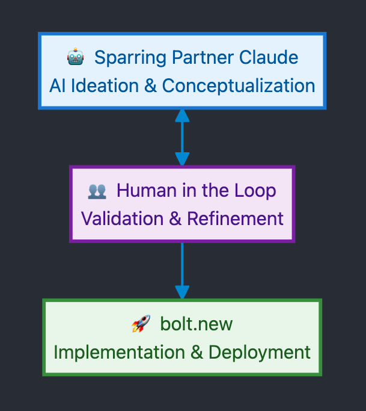
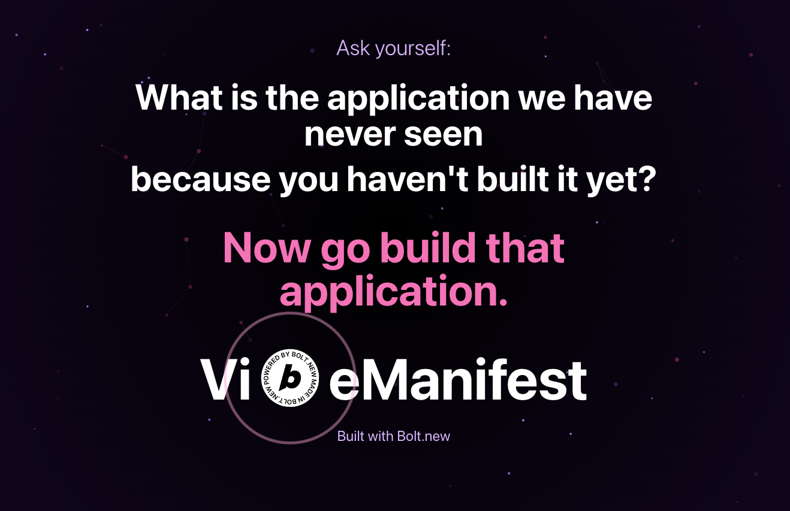
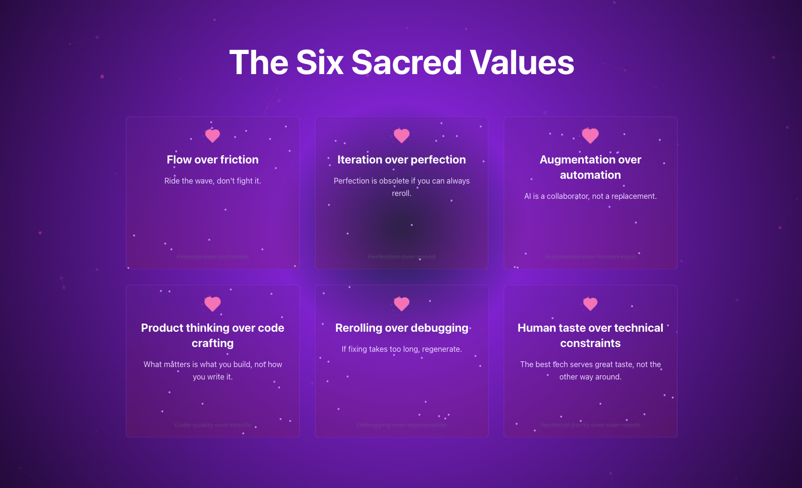
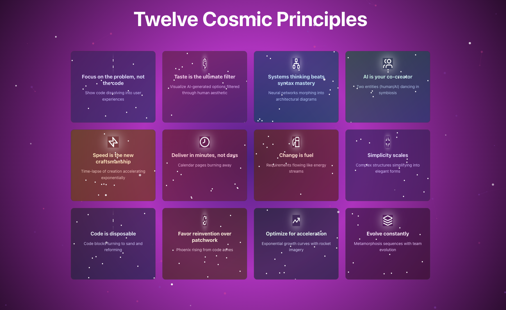
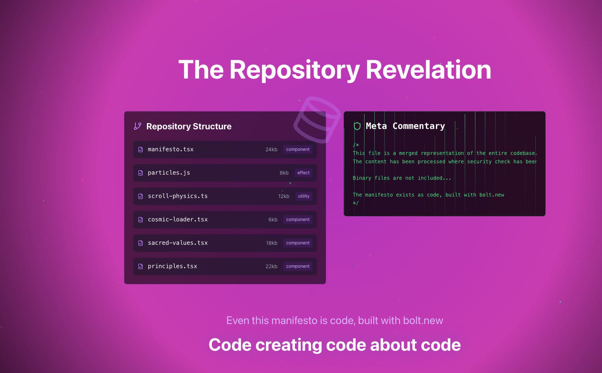
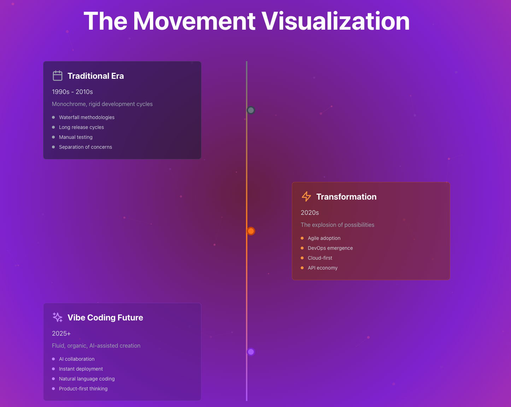
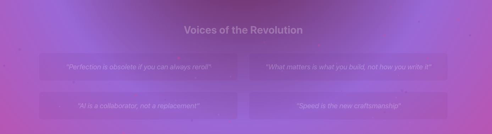
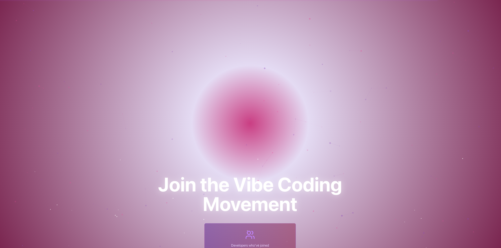
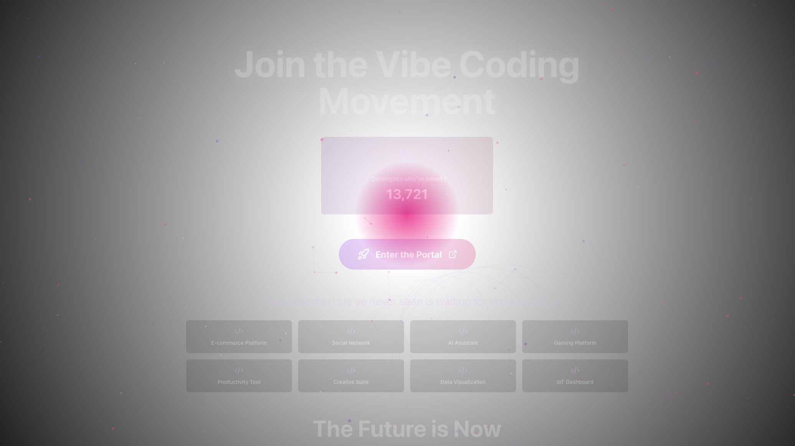
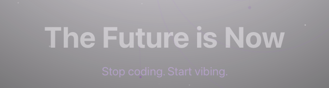

# One-Shot Competition
This is my contribution to the one-shot challenge in the World's Largest Hackathon presented by [bolt.new](https://bolt.new).  

[https://worldslargesthackathon.devpost.com](https://worldslargesthackathon.devpost.com)

Workflow:  

# video
[https://youtu.be/GndZ3q150Xg](https://youtu.be/GndZ3q150Xg)  

# application
[https://profound-stroopwafel-a1578c.netlify.app](https://profound-stroopwafel-a1578c.netlify.app)  

The application should also serve as a subdomain for my other domain.   
Unfortunately, I can't see it yet. Here is the URL of the subdomain. [http://manifest.vibedoc.online/](http://manifest.vibedoc.online/)  

# bolt.new url
https://bolt.new/~/sb1-mkk74q9b

# images

